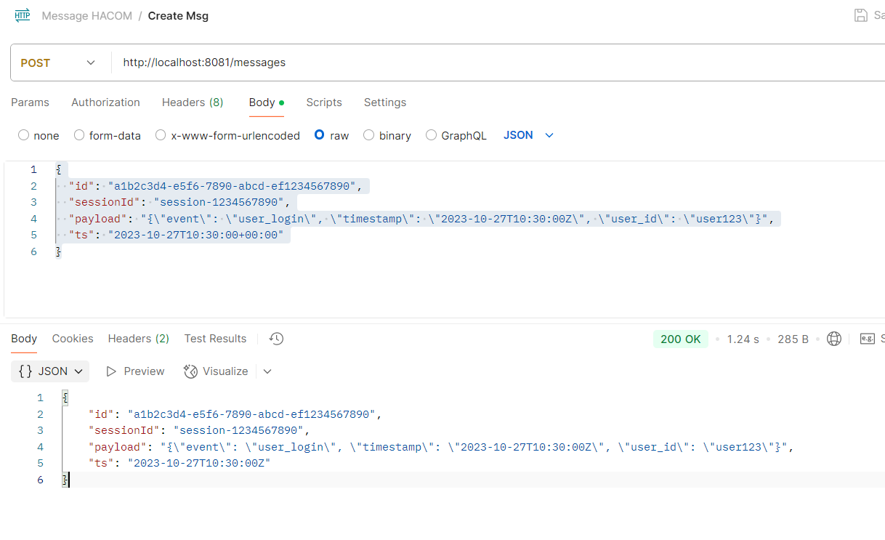
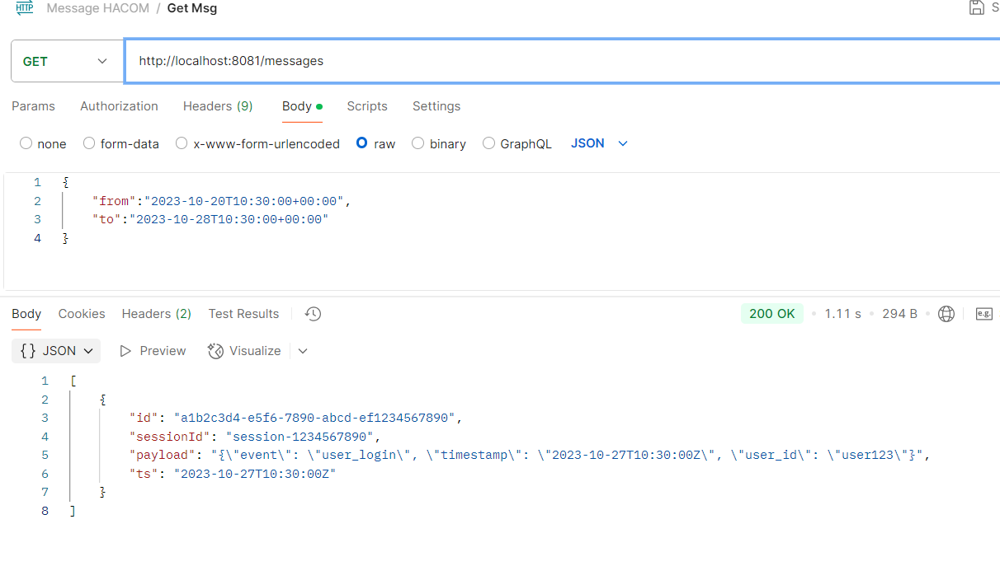
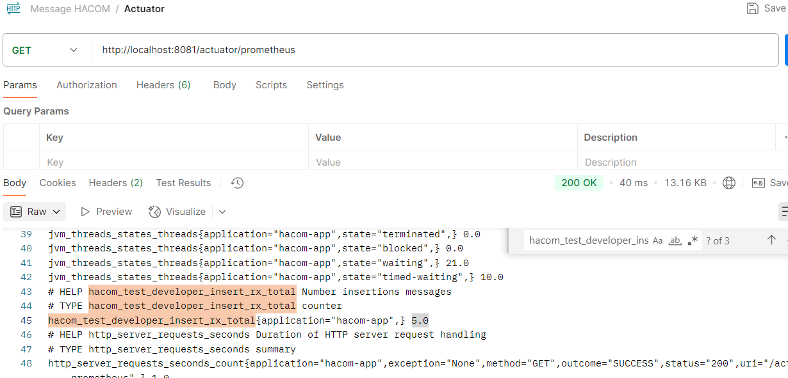

# 🛠️ Hacom Support Message

## 📝 Descripción
Aplicación Java Spring Boot que permite insertar y consultar mensajes en MongoDB de forma reactiva, utilizando `Spring WebFlux` y `Spring Data MongoDB Reactive`. Incluye monitoreo con `Spring Actuator` para Prometheus y `Log4j2` para logs.

---

## 🌐 Tecnologías Utilizadas
- ✅ Java 8
- ✅ Spring Boot 2.4.3
- ✅ Gradle
- ✅ Spring Data MongoDB Reactive
- ✅ Spring WebFlux
- ✅ Log4j2 (Configuración YAML)
- ✅ Spring Actuator con métricas para Prometheus
- ✅ Lombok (Opcional)

---

## 📋 Requisitos previos
1. MongoDB ejecutándose en `localhost:27017`.
2. Java 8 instalado.
3. Gradle instalado.

---

---

## ⚙️ Configuración en `application.yml`
```yaml
server:
  port : ${SERVER_PORT:8081}
spring:
  application:
    name: support-hacom-message-v1.0
mongodb:
  mongodbUri: "mongodb+srv://%s:%s@appName.qfrd4.mongodb.net/?retryWrites=true&w=majority&appName=appName"
  mongodbDatabase: "message"
  username: "${MONGO_USERNAME:changeIt}"
  password: "${MONGO_PASSWORD:changeIt}"

#Actuator Prometheus
management:
  endpoints:
    web:
      exposure:
        include: health, prometheus
  metrics:
    tags:
      application: hacom-app

```
✅ Ejemplo de JSON para Insertar un Mensaje
🔗 POST /messages
```json
{
  "id": "a1b2c3d4-e5f6-7890-abcd-ef1234567890",
  "sessionId": "session-1234567890",
  "payload": "{\"event\": \"user_login\", \"timestamp\": \"2023-10-27T10:30:00Z\", \"user_id\": \"user123\"}",
  "ts": "2023-10-27T10:30:00+00:00"
}
```

✅ Ejemplo de JSON para Buscar por Rango de Fechas
🔗 GET /messages
```json
{
"from": "2024-11-06T10:00:00Z",
"to": "2024-11-06T12:00:00Z"
}
```

🎯 Visualización de Métricas en Prometheus
Navega a:

```curl
http://localhost:9898/actuator/prometheus
```
🎯 Evidencias:





